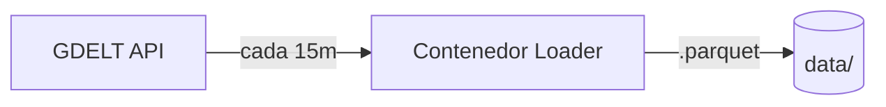
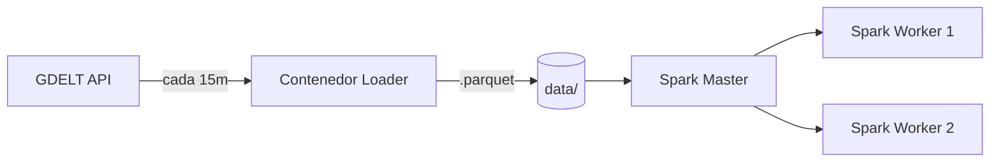
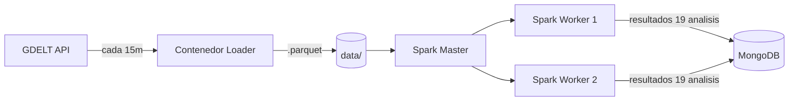
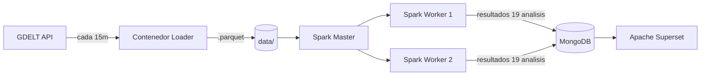
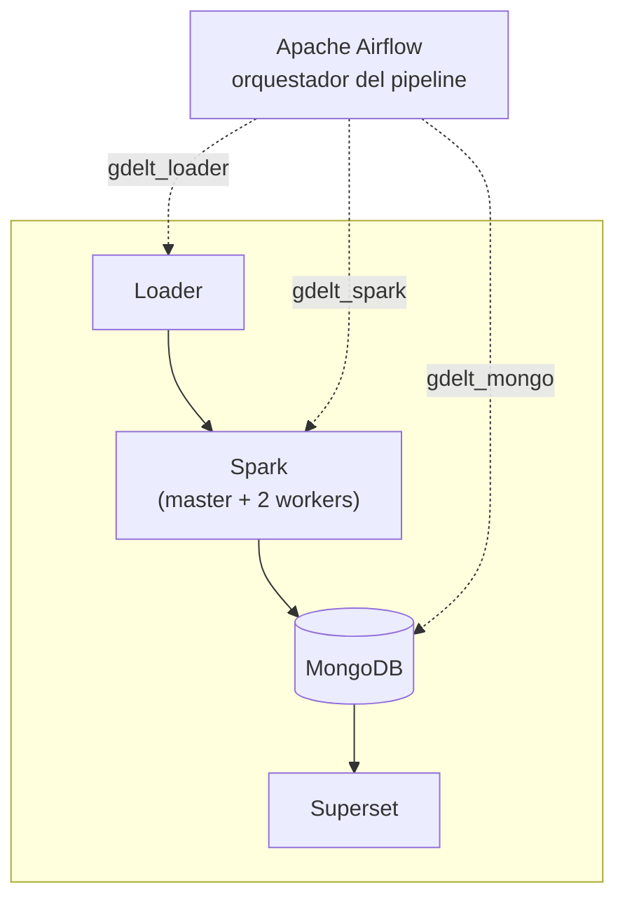

# Resumen de la arquitectura actual
---
Authors:
* Abraham Solano
---
## Explicación General de la Arquitectura
### Objetivo del proyecto
En pocas palabras consiste en montar un pipeline de análisis de datos, en contenedores.
La arquitectura que se propone para el proyecto es la siguiente:
* Loader de Datos
* Análisis de Spark
* Capa de presentación (con MongoDB como base de datos)
**Capas que no fueron agregadas en la visión original**
* Loader de Datos (incluye transformación de `.csv` a `.parquet`)
* Análisis de Spark
* Loader a MongoDB y esquemas necesarios para mapear los datos y sus estructuras
* Capa de presentación (con MongoDB como base de datos)
Siguiendo con la visión del proyecto se sugiere el uso de los siguientes contenedores:
* Contenedor del Loader
* Contenedor de Spark (al menos dos nodos: master y dos nodos workers)
* Contenedor de Mongo
* Contenedor de Capa de Presentación (Apache Superset)
> [!NOTE]
> Se valora utilizar Apache Airflow para el pipeline

### Funcionamiento de cada etapa

#### Loader
**Paso 1: Loader**

Se conecta a [GDELT](https://www.gdeltproject.org/) y baja los siguientes archivos: Events table, Mentions table y GKG. Esto se debe hacer cada 15 minutos de forma continua, manteniendo únicamente los datos RAW del período que el equipo decida (por ejemplo, la última hora), dado el volumen de información que genera GDELT.
Internamente el Loader también se encarga de transformar los archivos `.csv` descargados a `.parquet` antes de escribirlos a disco, eliminando la necesidad de un paso de transformación separado.
> En la URL "http://data.gdeltproject.org/gdeltv2/lastupdate.txt" se encuentra un archivo índice que contiene los tres archivos solicitados, mediante Airflow se llaman las funciones main y borrar_parquets_raw. La función main descarga los archivos de el índice y los convierte en archivos parquet, los archivos se guardan en un directorio durante una hora para ser analizados, pero borrar_parquets_raw se encarga de eliminar los archivos para no acumular espacio en disco.

#### Analisis 

**Paso 2: + Spark (Analisis)**

Ya con los datos, se debe de hacer el analisis, usando Spark leyendo los archivos Parquet.
> Nota: En este punto me di cuenta que Airflow es un most, es el `trigger` de Spark 

Son 17 analisis pedidos en el enunciado + 2 que nosotros agreguemos (TODO: decidir cuales 2).

Lista rapida pa no perderla (copiada del enunciado, falta mapear quien hace cual):
- Mapa de calor de intensidad de conflictos por pais por dia (escala Goldstein)
- Top 10 paises que generan mas eventos noticiosos por dia
- Correlacion AvgTone vs numero de fuentes
- Distribucion de tipos de eventos CAMEO por region
- Matriz de interaccion entre tipos de actores (gob vs militar vs rebeldes)
- Paises con mayor cobertura mediatica por evento
- Tendencia de sentimiento por pais en el tiempo (promedio movil AvgTone)
- Pares de paises que mas entran en conflicto
- Deteccion de escalada de eventos (aumento acelerado de menciones en 24h)
- Agrupamiento de eventos de conflicto por religion por region
- Principales temas del GKG por continente por año
- Organizaciones mas mencionadas globalmente por dia
- Analisis de rezago: tono de hoy predice conflicto de mañana?
- Grafo de red diplomacia vs conflictos entre paises
- Indice de diversidad de fuentes por pais
- Frecuencia de conflictos por etnia de los actores
- Deteccion de breaking news (0 a 100+ menciones en <1h)
- + 2 propios (pendiente)

**Cómo Spark lee datos de Parquet**

Spark nunca escribe datos a como vienen sino que solo escribe resultados de los análisis que hizo.

Cada análsiis está como un archivo `.py` separado dentro de la carpeta `jobs/`.

`df = spark.read.parquet(f"{DATA_PATH}/{table}.parquet")`

Como Parquet es de formato columnar (a diferencia de CSV) entonces en vez de guardar los datos fila por fila, los guarda columna por columna. Parquet ya trae "tageado" qué tipo de dato es cada columna ( número, texto, fecha, etc)  dentro del mismo archivo y así Spark no tiene que adivinar.

Entonces: spark.read.parquet(...) Spark no lee nada todavía.. Espera el resultado de verdad como
con .show() o .count().

Básicamente, en resumen, Spark hace esto:
1. Leer (spark.read.parquet)
2. Transformar (filter, groupBy, join, explode, Window) (nunca tocan datos hasta acción las dispara]
3. Actuar (.show(), count()).

**Qué hace cada métrica**

- Mapa de calor de intensidad de conflictos por pais por dia (escala Goldstein)
- Top 10 paises que generan mas eventos noticiosos por dia

`events.groupBy("actor1countrycode").agg(F.count("*").alias("total_events")).orderBy(F.desc("total_events")).limit(10)`

+ `groupBy("actor1countrycode")` agrupa todas las filas que comparten el mismo país.
+ `.agg(F.count("*"))` cuenta cuántas filas cayeron en cada grupo.
+ `.orderBy(F.desc(...))` ordena los grupos resultantes de mayor a menor.
+ `.limit(10)` se queda con los primeros 10.

- Correlacion AvgTone vs numero de fuentes

- Distribucion de tipos de eventos CAMEO por region
- Matriz de interaccion entre tipos de actores (gob vs militar vs rebeldes)
- Paises con mayor cobertura mediatica por evento
- Tendencia de sentimiento por pais en el tiempo (promedio movil AvgTone)
- Pares de paises que mas entran en conflicto
- Deteccion de escalada de eventos (aumento acelerado de menciones en 24h)
- Agrupamiento de eventos de conflicto por religion por region
- Principales temas del GKG por continente por año
- Organizaciones mas mencionadas globalmente por dia
- Analisis de rezago: tono de hoy predice conflicto de mañana?
- Grafo de red diplomacia vs conflictos entre paises
- Indice de diversidad de fuentes por pais
- Frecuencia de conflictos por etnia de los actores
- Deteccion de breaking news (0 a 100+ menciones en <1h)

  

#### Loader a MongoDB

**Paso 3: + MongoDB (Loader a Mongo)**

TODO: aca falta definir el esquema de Mongo. Por ahora la idea es que cada uno de los 19 analisis (17 + 2) tenga su propia coleccion en Mongo, ya con el resultado calculado (no datos crudos), pa que Superset solo tenga que leer y graficar sin tener que procesar nada.

Pendiente:
- Definir nombres de colecciones
- Definir estructura de documentos por cada analisis (capaz no todos son iguales, unos son series de tiempo, otros son rankings, otros son matrices/grafos)
- Quien hace el insert, Spark directo o un script aparte

> El encargado de esta área debe explicar su implementación.

#### Capa de Presentacion

**Paso 4: + Capa de Presentacion (pipeline completo)**

Se va a usar Apache Superset conectado a Mongo (o a lo que termine siendo el datasource final, revisar si Superset jala bien de Mongo directo o si toca meter algo intermedio).

La idea es que sea sencillo, nada de drill downs como dice el enunciado, solo mostrar los 19 analisis con su grafico/tabla correspondiente, en una o varias paginas/dashboards.

TODO:
- Confirmar conexion Superset-Mongo
- Armar los dashboards
- Las 3 conclusiones que pide el enunciado (esto se hace al final cuando ya hay datos reales)

> El encargado de esta área debe explicar su implementación.

#### Capa final - Orquestacion por medio de Airflow 

**Diagrama final: pipeline completo con Airflow como orquestador**

> Nota: las flechas solidas son flujo de datos, las punteadas son orquestacion (Airflow no mueve datos, solo dispara/coordina cada paso).
