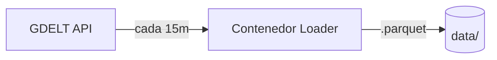
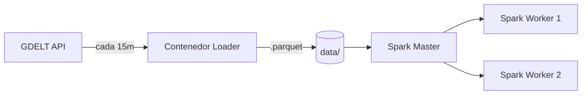
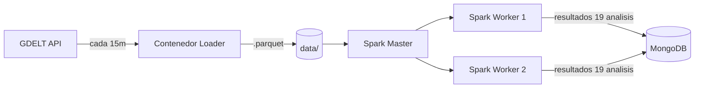
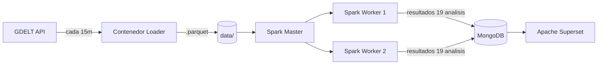
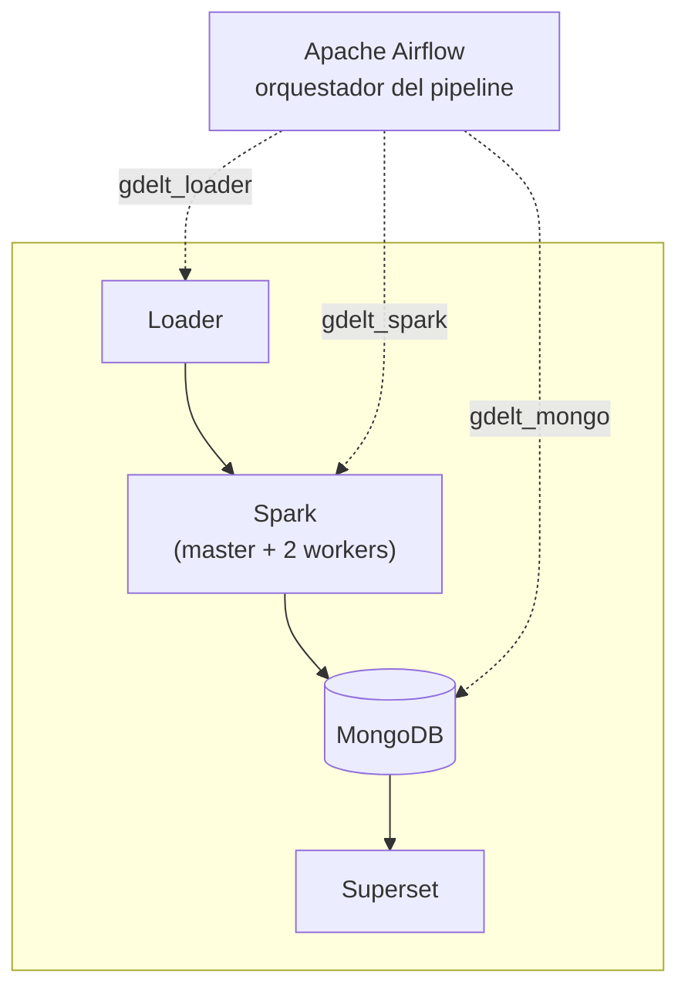

# Análisis de Eventos Mundiales: Pipeline con datos de GDELT

Resumen general
---
El equipo consiste en montar un pipeline de análisis de datos y correr en contenedores.
Las partes básicas de la tarea son un loader de datos con Apache Parquet, un análisis con Spark y por último una capa de presentación en Apache Superset que usa MongoDB como Base de Datos.
Como flujo básico se cuenta con un Contendor para el loader, los Contenedores de Spark, además, el contenedor de MongoDB y de la capa de Presentación Apache Superset.

Equipo
---
+ Abraham Gerardo Solano Parrales 🐐
  
+ Sofia Elena Barrantes Miranda
  
+ Daniel Josué Herrera Córdoba
  
+ Kevin David Jiménez Escalante
  

Arquitectura del proyecto
---

### Propuesta

La arquitectura que se propone para el proyecto es la siguiente:
* Loader de Datos
* Análisis de Spark
* Capa de presentación (con MongoDB como base de datos)
  
**Capas que no fueron agregadas en la visión original**
* Loader de Datos (incluye transformación de `.csv` a `.parquet`)
* Análisis de Spark
* Loader a MongoDB y esquemas necesarios para mapear los datos y sus estructuras
* Capa de presentación (con MongoDB como base de datos)
Siguiendo con la visión del proyecto se sugiere el uso de los siguientes contenedores:
* Contenedor del Loader
* Contenedor de Spark (al menos dos nodos: master y dos nodos workers)
* Contenedor de Mongo
* Contenedor de Capa de Presentación (Apache Superset)
> [!NOTE]
> Se valoró utilizar Apache Airflow para el pipeline

    Un módulo se encarga de descargar archivos de GDELT usando el archivo índice en la URL "http://data.gdeltproject.org/gdeltv2/lastupdate.txt". Primero se descarga este archivo y los archivos comprimidos a los que apunta, después se extraen los datos relevantes en un dataframe y por último se transforman en archivos parquet que se guardan en un directorio durante una hora antes de ser borrados.

	Los datos son procesados utilizando Apache Spark, se utiliza esta herramienta porque es un sistema distribuido que ayuda a repartir el trabajo, resultando en mayor eficiencia para procesar grandes flujos de datos. Para este módulo se usa un mini-cluster de 3 nodos, un maestro que se encarga de coordinar a los otros nodos y dos que analizan los datos. De este análisis de datos van a salir los resultados a las 17 consultas solicitadas más las 2 consultas propias.
    
	De todos los datos creados y procesados, únicamente los resultados de las 19 consultas se van a guardar en MongoDB, los archivos parquet se guardan en un directorio temporalmente y las estructuras intermedias se crean y borran en memoria automáticamente. En la siguiente sección de la documentación se entra más en detalle respecto a la base de datos.
    
	Todos estos módulos son orquestados usando Apache Airflow, esta herramienta fué seleccionada puesto que tiene varias ventajas: tiene características resistente a fallos, si algo sale mal, reintenta la operación para prevenir que todo el contenedor deje de funcionar; tiene una interfaz gráfica intuitiva para monitorear el flujo de trabajo; trabaja exclusivamente en python, lo que simplifica su programación y tiene una arquitectura modular que brinda una buena escalabilidad. El módulo de Airflow se divide en varios Grafos acíclicos dirigidos (DAGs por sus siglas in inglés) y consiste en una para cada sección del pipeline, uno para el loader, otro para Spark y otro para mongoDB.

## Funcionamiento de cada etapa

#### Loader
**Paso 1: Loader**

Se conecta a [GDELT](https://www.gdeltproject.org/) y baja los siguientes archivos: Events table, Mentions table y GKG. Esto se debe hacer cada 15 minutos de forma continua, manteniendo únicamente los datos RAW del período que el equipo decida (por ejemplo, la última hora), dado el volumen de información que genera GDELT.
Internamente el Loader también se encarga de transformar los archivos `.csv` descargados a `.parquet` antes de escribirlos a disco, eliminando la necesidad de un paso de transformación separado.
> En la URL "http://data.gdeltproject.org/gdeltv2/lastupdate.txt" se encuentra un archivo índice que contiene los tres archivos solicitados, mediante Airflow se llaman las funciones main y borrar_parquets_raw. La función main descarga los archivos de el índice y los convierte en archivos parquet, los archivos se guardan en un directorio durante una hora para ser analizados, pero borrar_parquets_raw se encarga de eliminar los archivos para no acumular espacio en disco.

#### Analisis 

**Paso 2: + Spark (Analisis)**

Ya con los datos, se debe de hacer el analisis, usando Spark leyendo los archivos Parquet.
> Nota del equipo: En este punto un miembro se dio cuenta que Airflow es un most, es el `trigger` de Spark 

**17 consultas a analizar**
- Mapa de calor de intensidad de conflictos por pais por dia (escala Goldstein)
- Top 10 paises que generan mas eventos noticiosos por dia
- Correlacion AvgTone vs numero de fuentes
- Distribucion de tipos de eventos CAMEO por region
- Matriz de interaccion entre tipos de actores (gob vs militar vs rebeldes)
- Paises con mayor cobertura mediatica por evento
- Tendencia de sentimiento por pais en el tiempo (promedio movil AvgTone)
- Pares de paises que mas entran en conflicto
- Deteccion de escalada de eventos (aumento acelerado de menciones en 24h)
- Agrupamiento de eventos de conflicto por religion por region
- Principales temas del GKG por continente por año
- Organizaciones mas mencionadas globalmente por dia
- Analisis de rezago: tono de hoy predice conflicto de mañana?
- Grafo de red diplomacia vs conflictos entre paises
- Indice de diversidad de fuentes por pais
- Frecuencia de conflictos por etnia de los actores
- Deteccion de breaking news (0 a 100+ menciones en <1h)
- + 2 propios (pendiente)

**Cómo Spark lee datos de Parquet**

Spark nunca escribe datos a como vienen sino que solo escribe resultados de los análisis que hizo.

Cada análsiis está como un archivo `.py` separado dentro de la carpeta `jobs/`.

`df = spark.read.parquet(f"{DATA_PATH}/{table}.parquet")`

Como Parquet es de formato columnar (a diferencia de CSV) entonces en vez de guardar los datos fila por fila, los guarda columna por columna. Parquet ya trae "tageado" qué tipo de dato es cada columna ( número, texto, fecha, etc)  dentro del mismo archivo y así Spark no tiene que adivinar.

Entonces: spark.read.parquet(...) Spark no lee nada todavía. Espera el resultado de verdad como con .show() o .count().

En resumen, Spark realiza esto:
1. Leer (spark.read.parquet)
2. Transformar (filter, groupBy, join, explode, Window) (nunca tocan datos hasta acción las dispara]
3. Actuar (.show(), count()).

**Qué hace cada métrica**

1. Mapa de calor de intensidad de conflictos por pais por dia (escala Goldstein)
2. Top 10 paises que generan mas eventos noticiosos por dia
3. Correlacion AvgTone vs numero de fuentes
4. Distribucion de tipos de eventos CAMEO por region
5. Matriz de interaccion entre tipos de actores (gob vs militar vs rebeldes)
6. Paises con mayor cobertura mediatica por evento
7. Tendencia de sentimiento por pais en el tiempo (promedio movil AvgTone)
8. Pares de paises que mas entran en conflicto
9. Deteccion de escalada de eventos (aumento acelerado de menciones en 24h)
10. Agrupamiento de eventos de conflicto por religion por region
11. Principales temas del GKG por continente por año
12. Organizaciones mas mencionadas globalmente por dia
13. Analisis de rezago: tono de hoy predice conflicto de mañana?
14. Grafo de red diplomacia vs conflictos entre paises
15. Indice de diversidad de fuentes por pais
16. Frecuencia de conflictos por etnia de los actores
17. Deteccion de breaking news (0 a 100+ menciones en <1h)
EXTRA 1. Distribución de eventos positivos y negativos
EXTRA 2. Top 10 países menos noticiosos

#### Loader a MongoDB

**Paso 3: + MongoDB (Loader a Mongo)**

Cada uno de los 19 analisis (17 + 2) tiene su propia coleccion en MongoDB, ya con el resultado calculado (no datos crudos), para que Superset solo tenga que leer y graficar sin tener que procesar nada.

Se definien los nombres de colecciones, la estructura de documentos por cada análisis ya que no todos son iguales, unos son series de tiempo, otros son rankings y otros son matrices/grafos.

> El encargado de esta área debe explicar su implementación. !!!!!

#### Capa de Presentacion

**Paso 4: + Capa de Presentacion (pipeline completo)**

Decición del equipo: Se va a usar Apache Superset conectado a MongoDB (o lo que termine siendo el datasource final y se revisar en caso de que Superset extrae bien de MongoDB directamente o si se necesita un elemento intermedio).

Se muestra los 19 análisis con su grafico/tabla correspondiente, en una o varias paginas/dashboards sin drill downs

#### Capa final - Orquestación por medio de Airflow 

**Diagrama final: pipeline completo con Airflow como orquestador**

> Nota: las flechas solidas son flujo de datos, las punteadas son orquestacion (Airflow no mueve datos, solo dispara/coordina cada paso).
