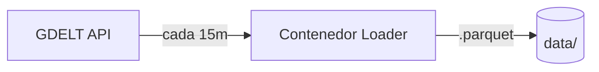

#### Loader
**Paso 1: Loader**

Se conecta a [GDELT](https://www.gdeltproject.org/) y baja los siguientes archivos: Events table, Mentions table y GKG. Esto se debe hacer cada 15 minutos de forma continua, manteniendo únicamente los datos RAW del período que el equipo decida (por ejemplo, la última hora), dado el volumen de información que genera GDELT.
Internamente el Loader también se encarga de transformar los archivos `.csv` descargados a `.parquet` antes de escribirlos a disco, eliminando la necesidad de un paso de transformación separado.
> En la URL "http://data.gdeltproject.org/gdeltv2/lastupdate.txt" se encuentra un archivo índice que contiene los tres archivos solicitados, mediante Airflow se llaman las funciones main y borrar_parquets_raw. La función main descarga los archivos de el índice y los convierte en archivos parquet, los archivos se guardan en un directorio durante una hora para ser analizados, pero borrar_parquets_raw se encarga de eliminar los archivos para no acumular espacio en disco.
